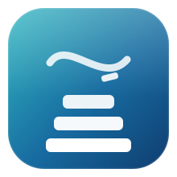

<p align="center">
  <picture>
    <source media="(prefers-color-scheme: dark)" srcset="docs/assets/readme/logo-dark.svg">
    
  </picture>
</p>

<h1 align="center">Tidewell</h1>

<p align="center">
  Files land in a folder. Tidewell files them.<br>
  A file organiser for macOS that <strong>cannot delete your files</strong>.
</p>

<p align="center">
  <a href="https://tidewell.iam-deepak.space"><strong>tidewell.iam-deepak.space</strong></a>
</p>

<p align="center">
  <a href="../../actions/workflows/ci.yml"></a>
  <a href="../../releases"></a>
  <a href="LICENSE"></a>
  
  
</p>

---

Your Downloads folder fills up. Every organiser that fixes it can also destroy it — they
move, rename, *and delete*, and most of them cannot undo a thing. So you either trust one
completely or keep doing it by hand.

Tidewell is built the other way round. The engine has **no delete, no trash and no
overwrite anywhere in it** — not as a setting, but as a matter of what the code is able to
express. A CI test greps the whole engine and fails the build if such a call ever appears.
The worst a bug can do is put a file in the wrong folder, and you can undo that.

## Why you might want it

- **It cannot delete your files.** `FileMover` can create a folder and move a file. That
  is all it can do.
- **It shows you first.** Every run can be previewed — every file, where it would go, and
  why anything is being left alone.
- **Everything is reversible.** Because nothing is destroyed, undo is just another move.
- **It never touches folders.** Only loose files. Your own folders are left exactly alone.
- **It waits for downloads.** A file still being written is sampled twice and skipped.
- **Nothing leaves your Mac.** There is no network code in the app. That is [checked in
  CI](.github/workflows/ci.yml), not just claimed here.
- **It can only reach folders you chose.** Tidewell runs in the App Sandbox, so that is
  enforced by macOS rather than promised by the code.

## Install

**Recommended — compiles on your machine, so there is no Gatekeeper warning at all:**

```bash
brew install evdeepak120202/tap/tidewell
```

Or download it from **[tidewell.iam-deepak.space](https://tidewell.iam-deepak.space)**, which picks the right
build for your Mac. Homebrew is still the recommendation: a downloaded build is not
notarised and macOS will make you approve it in System Settings first.

<details>
<summary>From source</summary>

```bash
git clone https://github.com/evdeepak120202/tidewell
cd tidewell
./Scripts/make-signing-cert.sh   # once — gives the app a stable identity
./Scripts/build.sh
./Scripts/install.sh
```
</details>

<details>
<summary>Download a build (shows a security warning — here is why)</summary>

Grab `Tidewell-arm64.zip` from [Releases](../../releases), or use
[tidewell.iam-deepak.space](https://tidewell.iam-deepak.space) which detects which one you need. On an Intel Mac,
take `Tidewell-universal.zip`.

These builds are **not notarised**, because notarisation requires a paid Apple Developer
membership this project does not have. macOS will refuse to open the app until you go to
**System Settings › Privacy & Security** and click **Open Anyway**.

Rather than asking you to ignore a security warning, here is how to check the build
yourself:

```bash
shasum -a 256 -c SHA256SUMS.txt
```

The Homebrew install above avoids the question entirely by building from source on your
own machine.
</details>

## How it works

Pick some folders. Tidewell watches them and files what arrives.

| Sort by | Result |
| --- | --- |
| **Category** | `Images/`, `Documents/`, `Archives/`, `Video/`, `Code/` … |
| **Extension** | `PNG/`, `PDF/`, `ZIP/` … |
| **Category, then month** | `Documents/2026-08/` |

Chosen **per folder**, because Downloads and a screenshot dump do not want the same shape.

**Name rules come first.** A glob like `day-sheet-*` → `Day Sheets` is checked before file
type, in your order, first match wins. This matters more than it sounds: twenty-three
`day-sheet-….pdf` are all "Documents" by type, which is true and useless.

**Duplicates are set aside, never deleted.** A file byte-identical to one already filed
goes to `Duplicates/` instead of being filed a second time. Detection is SHA-256 of the
contents with size as a pre-filter, so a file that merely shares a name is filed normally.

**Old files can be archived.** Files untouched past a chosen age move to `Archive/YYYY-MM`.
The sweep only looks inside folders Tidewell itself created — never the archive, never
folders you made.

### Rules

Beyond sorting by type, a rule combines conditions — name, extension, kind, size, age,
whether it is a duplicate — with **all**, **any** or **none**, and says what to do when
they hold. Rules are checked before everything else, in your order, first match wins.

The actions are: file into a folder, add a Finder tag, set a colour label, leave it alone,
or set it aside for review. **There is no delete action, and no run-a-script action.**
Hazel has both. A folder-watching background agent that can execute shell is a permanent
remote-code-execution surface, and a rule engine that can delete turns a mistyped pattern
into data loss.

### App Sweep

Removed an app and want the hundreds of megabytes it left in your Library? Point Tidewell
at it and it finds them — matched on **bundle identifier only**, never on the app's name,
because a name match would sweep anything containing the word.

It then **gathers** them into a folder for you to look through. It does not delete them.
"Probably belongs to that app" is a guess, and a guess should not be able to destroy a
licence file or a save game.

This needs one-time access to your Library folder, granted through a panel like any other.

### Six starting points

Setup asks one real question, and pre-selects an answer based on what is actually in your
folders:

| Style | What it does |
| --- | --- |
| **Tidy** | A folder per kind of file. The default. |
| **Minimal** | Three folders: Media, Documents, Other. |
| **Librarian** | Category plus month, for high volume. |
| **Maker** | Code, Archives and Installers first; leaves documents alone. |
| **Creative** | Photos and video by month, RAW kept apart from JPEG. |
| **Caretaker** | **Files nothing.** Only sets aside duplicates and archives stale files. |

Caretaker is there on purpose: if your folders already work the way you want, you should
still get the duplicate and staleness value without Tidewell imposing a taxonomy on you.

### Reading documents, on your Mac only

Optional, **off until you turn it on**, and needs macOS 26 on Apple silicon.

A file called `scan_001.pdf` tells you nothing, and no rule engine can help — the name is
all they have. Tidewell can read the first page on-device and file it as an invoice, a
contract or a statement.

The guardrails matter more than the feature:

- **Nothing is uploaded.** The model runs on your Mac and Tidewell has no network code.
- **Tidewell never downloads a model.** Apple Intelligence is managed by macOS; the app
  explains and links to System Settings, and nothing more.
- **The model picks one word from a fixed list.** It never produces a folder name or a
  path, so a document that tries to redirect it can at worst cause a *wrong label* —
  visible in the preview and undoable.
- **Only for files whose name says nothing.** Most files never touch it.
- **Skipped on low power or when the Mac is hot.**
- **Per folder**, and folders whose name suggests private documents (tax, medical, legal)
  are left off by default.
- **Turning it off purges everything it learned.**

### Shortcuts

Five actions, so you can automate Tidewell without it ever running your code:
`Organize Folder`, `Preview Folder`, `Undo Last Organize`, `Archive Old Files`,
`Set Automatic Filing`.

This is the deliberate alternative to Hazel's run-a-shell-script action. A folder-watching
background agent that can execute arbitrary shell is a permanent security hole; safe named
verbs let you compose in Shortcuts instead.

## How it compares

| | Hazel | Forel | organize | Cloud AI organisers | **Tidewell** |
| --- | --- | --- | --- | --- | --- |
| Price | $42 | Free | Free | Subscription | Free |
| Open source | ✗ | ✓ | ✓ | ✗ | ✓ |
| Preview before acting | ✗ | ✗ | `--dry-run` | ✗ | **Always** |
| Undo a run | Partial | ✗ | ✗ | Varies | **Every run** |
| Can delete your files | ✓ | ✓ | ✓ | ✓ | **Never** |
| Duplicate detection | ✗ | ✗ | ✓ | Some | ✓ |
| Files leave your Mac | ✗ | ✗ | ✗ | **✓** | ✗ |
| Runs scripts on arrival | ✓ | ✗ | ✓ | ✗ | ✗ *(deliberately)* |
| Shortcuts actions | ✗ | ✗ | ✗ | Some | ✓ |
| Reads document contents | ✗ | ✗ | ✗ | ✓ *(uploads them)* | **✓ *(on-device)*** |

Hazel is more capable than Tidewell and has been for fifteen years — it has a full
condition/action rule engine, App Sweep and Trash management. If you want all of that and
do not mind paying, buy Hazel. Tidewell is for people who want the folder tidied without
handing an automated tool the ability to delete things.

Arbitrary script execution is missing on purpose: a folder-watching background agent that
can run shell is a permanent security hole. Use Shortcuts via App Intents instead — see [Shortcuts](#shortcuts) below.

## Safety, in detail

| Guarantee | How it is enforced |
| --- | --- |
| Never deletes or overwrites | `FileMover` has no such API; CI greps the engine for `removeItem`, `trashItem`, `replaceItem`, `unlink` |
| Never touches folders | `SafetyGuard` rejects directories, packages, symlinks, aliases |
| Never overwrites on a name clash | The *incoming* file is renamed ` 2`, ` 3` — what is on disk is untouched |
| Never moves a file mid-download | Partial extensions skipped; everything else sampled twice |
| Never organises a dangerous root | `/`, `/System`, `/Applications`, your home folder and volume roots are refused |
| Never leaves your Mac | CI greps all sources for `URLSession`, `NWConnection`, `CFSocket` … |
| Never reaches a folder you didn't choose | App Sandbox — enforced by macOS, not by the code |

## Building

```bash
swift build -c release --arch arm64     # or --arch x86_64
swift test  --arch arm64
./Scripts/build.sh                      # -> build/Tidewell.app
ARCHS=universal ./Scripts/build.sh      # arm64 + x86_64
```

A Swift package plus a build script rather than an `.xcodeproj`, so Info.plist, icon and
signing stay reviewable in a diff.

## Sandboxing

Tidewell runs inside the **App Sandbox**. A non-sandboxed app inherits your full user
permissions — it *can* read and move any file your account can, and only its own code
stops it. Sandboxed, it can reach the folders you picked and nothing else, and the kernel
is what refuses the rest.

That means access has to survive quitting, which it does through **security-scoped
bookmarks**: a token minted when you choose a folder, stored, and resolved on each launch.
Bookmarks can go stale — a moved folder, a macOS upgrade — so Tidewell re-mints and saves
them when that happens, rather than working for one launch and then quietly stopping.

The entitlements are deliberately short, and everything absent from
[`Resources/Tidewell.entitlements`](Resources/Tidewell.entitlements) is refused: no
network, no camera or microphone, no contacts or calendars, and no blanket access to
Downloads, Documents or Desktop. Those are chosen, not assumed.

## Compatibility

Minimum **macOS 14 Sonoma**. `Tidewell-arm64` is the primary build; `Tidewell-universal`
is provided for Intel Macs and **will be retired** when the minimum moves past macOS 26 or
when Intel security updates end — macOS 26 is the last release supporting Intel, and macOS
27 is Apple silicon only.

## FAQ

**Is it safe to point at my Downloads folder?**
Preview it first — the button is right there and nothing moves until you say so.

**What if it files something wrongly?**
Undo the run. Both ends of every move are recorded, and nothing was deleted.

**Does it phone home?**
No. There is no network code in the app, and CI fails if any is added.

**Why is there a security warning on the download?**
It is not notarised — see [Install](#install). The Homebrew route has no warning.

**Can I make it delete duplicates?**
No. It sets them aside in `Duplicates/` for you to decide. That is the whole point.

## Contributing

[CONTRIBUTING.md](CONTRIBUTING.md) · [SECURITY.md](SECURITY.md) ·
[CODE_OF_CONDUCT.md](CODE_OF_CONDUCT.md) · [SUPPORT.md](SUPPORT.md)

## Who made this

Built by [Deepak](https://iam-deepak.space) for his own Downloads folder, then made
properly because the alternatives could all delete files.

## Licence

[GPL-3.0-or-later](LICENSE) for the source. The Tidewell name, icon and branding are **not**
covered by that grant — see [TRADEMARKS.md](TRADEMARKS.md). Forks must rename, so that a
user can always tell an official build from one that has had its guarantees removed.

<p align="center">
  <sub><a href="https://tidewell.iam-deepak.space">tidewell.iam-deepak.space</a> · <a href="https://iam-deepak.space">iam-deepak.space</a></sub>
</p>
